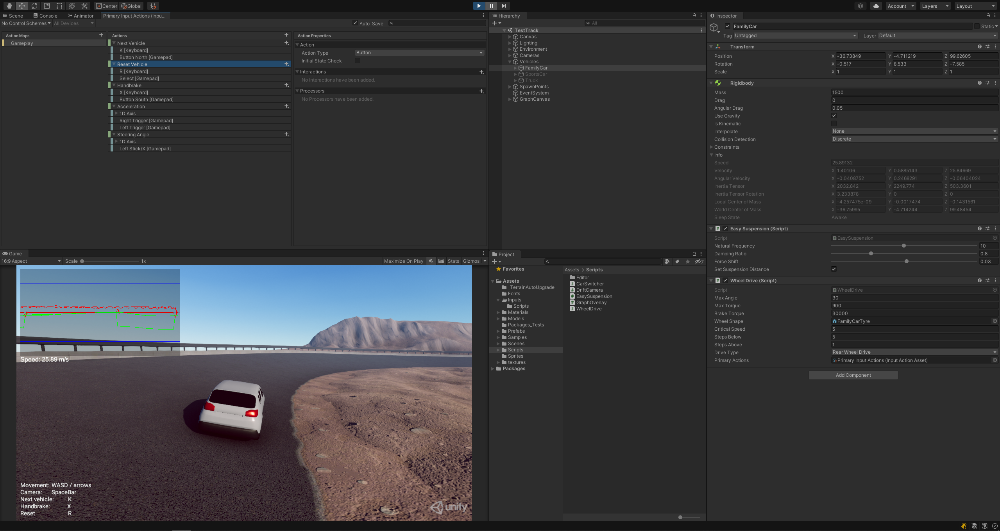

# Using the Input System in Unity

[[Tutorial Link]](https://learn.unity.com/project/using-the-input-system-in-unity?uv=2020.1)

## Preview

## Notes

- Project Settings > Input System Package
- Right Click > Input Actions (Edit asset)
- Input Actions Window > Control Schemes (Top Left Corner)
- `InputValue`
- `controls.Player.Move.performed += ctx => SendMessage(ctx.ReadValue<Vector2>());`
- Window > Analysis > Input Debugger
- Window > Package Manager > Input System > Samples > Visualizers
- Input Control Visualizer
- Input Action Visualizer
- Input Testing
- Input Actions Window > Binging Properties > Processors > Invert
